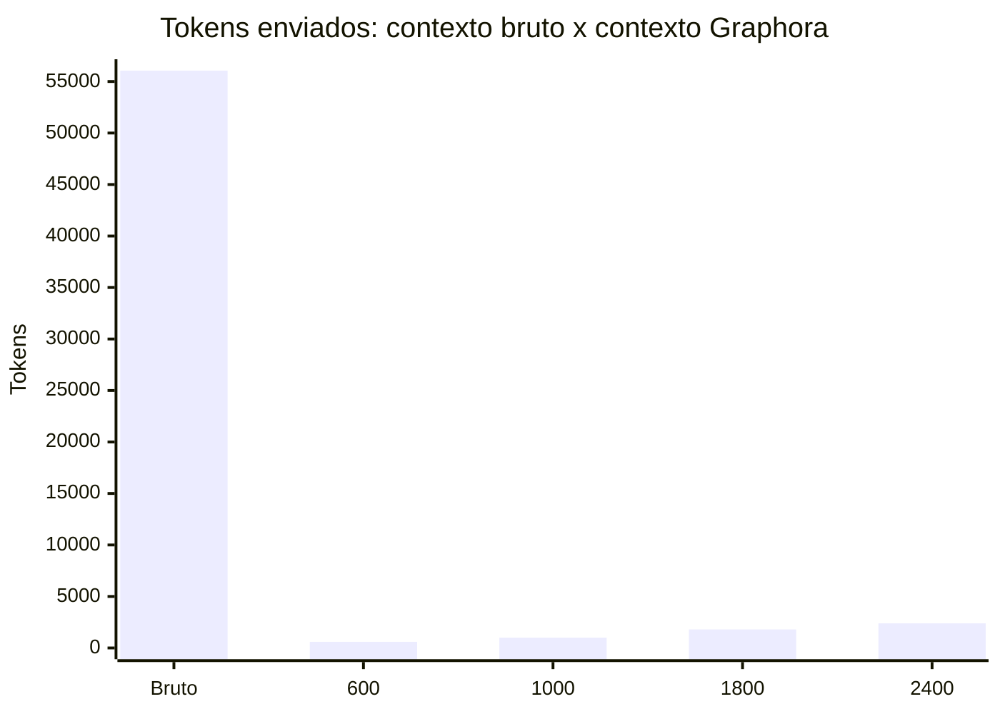
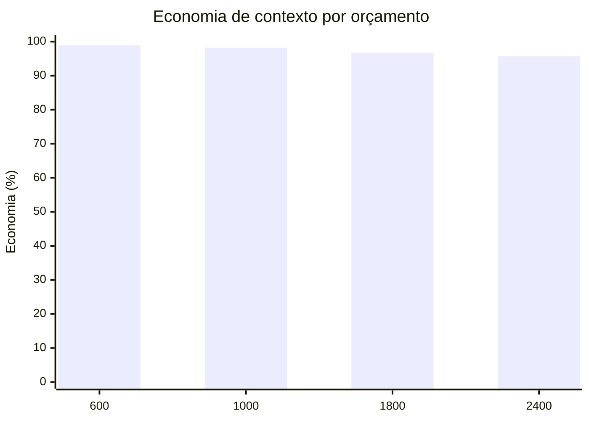

# Graphora


> Inteligência local de projetos, memória persistente e observatório 3D para código.

[](https://nodejs.org/)
[](#licença)
[](#status)

O Graphora transforma um projeto de software em um grafo navegável e consultável, preservando a origem das informações. Ele analisa arquivos e símbolos, resolve relações entre módulos, mantém um relatório local, oferece consultas com orçamento de tokens e abre um painel 3D executado exclusivamente em loopback.

A proposta é simples: ajudar pessoas e agentes de desenvolvimento a entenderem um repositório sem perder contexto, evidência ou decisões importantes.

## Sumário

- [Por que usar](#por-que-usar)
- [Quando usar](#quando-usar)
- [Principais benefícios](#principais-benefícios)
- [Graphora e Graphify](#graphora-e-graphify)
- [Economia real de tokens](#economia-real-de-tokens)
- [Requisitos](#requisitos)
- [Instalação](#instalação)
- [Primeiros passos](#primeiros-passos)
- [Comandos](#comandos)
- [Consultas com contexto limitado](#consultas-com-contexto-limitado)
- [Memória persistente](#memória-persistente)
- [Integração com assistentes](#integração-com-assistentes)
- [Arquivos gerados](#arquivos-gerados)
- [Arquitetura](#arquitetura)
- [Privacidade e segurança](#privacidade-e-segurança)
- [Desenvolvimento](#desenvolvimento)
- [Solução de problemas](#solução-de-problemas)
- [Status](#status)
- [Licença](#licença)

## Por que usar

Projetos reais acumulam dependências, convenções, decisões e relações que não cabem em uma única leitura de arquivo. O Graphora cria uma camada local de entendimento que pode ser consultada por humanos e ferramentas de IA.

Ele é especialmente útil quando você precisa:

- localizar rapidamente onde um comportamento é implementado;
- entender dependências e relações entre módulos;
- recuperar contexto relevante sem enviar o repositório inteiro para um modelo;
- manter decisões de arquitetura associadas às fontes que as justificam;
- visualizar a topologia de um projeto em um painel interativo;
- acompanhar mudanças com atualização incremental;
- oferecer a mesma base de contexto para diferentes assistentes.

## Quando usar

Use o Graphora no início de um trabalho em um repositório desconhecido, durante uma refatoração, ao investigar um bug que atravessa módulos ou quando um agente precisa consultar o projeto com limites claros de contexto.

Ele funciona melhor como uma ferramenta local de entendimento e investigação. Não substitui testes, revisão de código, observabilidade de produção, um banco de dados de conhecimento externo ou uma pipeline de deploy.

## Principais benefícios

| Benefício                    | O que significa na prática                                                                        |
| ---------------------------- | ------------------------------------------------------------------------------------------------- |
| **Evidência na fonte**       | Respostas e relações apontam para arquivos e linhas do projeto.                                   |
| **Contexto controlado**      | Consultas aceitam orçamento de tokens e profundidade, reduzindo excesso de informação.            |
| **Atualização incremental**  | O watcher acompanha alterações sem exigir uma reconstrução manual a cada mudança.                 |
| **Memória atribuída**        | Decisões registram autor, base, tipo e fontes, em vez de serem confundidas com fatos descobertos. |
| **Privacidade local**        | O painel é servido em `127.0.0.1`; o projeto não precisa sair da máquina para ser analisado.      |
| **Visão estrutural**         | O grafo e o observatório 3D tornam módulos, símbolos e relações exploráveis visualmente.          |
| **Integração MCP**           | Assistentes compatíveis podem consultar e atualizar a mesma base por stdio.                       |
| **Separação entre projetos** | A rede de projetos mantém grafos individuais e trata padrões recorrentes separadamente.           |

## Graphora e Graphify

Graphora e Graphify resolvem problemas relacionados, mas o Graphora é mais completo para o trabalho diário em um repositório de software. Ele não apenas transforma conteúdo em um grafo: acompanha o projeto, entende relações entre arquivos e símbolos, devolve contexto com evidência, registra decisões e mantém tudo disponível para consultas futuras.

Em outras palavras, o Graphify é uma boa camada de graphificação; o Graphora é uma camada operacional de inteligência contínua para código.

| Critério              | Graphora: vantagem operacional                                      | Graphify: foco mais geral                                |
| --------------------- | ------------------------------------------------------------------- | -------------------------------------------------------- |
| Foco principal        | Entendimento contínuo de repositórios de software                   | Transformação de entradas em grafos de conhecimento      |
| Unidade de trabalho   | Projeto, arquivos, símbolos, módulos e decisões                     | Conteúdo ou fontes fornecidas à pipeline                 |
| Atualização           | Incremental, com watcher e remoção de conteúdo obsoleto             | Depende da estratégia de ingestão adotada                |
| Evidência             | Cada resposta pode apontar para arquivo e linha                     | Depende do adaptador e do formato de saída               |
| Consultas             | `budget`, `depth`, seleção de nó e resposta JSON                    | Depende da interface e do grafo produzido                |
| Economia de tokens    | Busca apenas o subgrafo relevante antes de montar o contexto        | Depende de como a aplicação consome o grafo              |
| Memória               | Decisões persistentes com autor, base e fontes                      | Mais orientado à construção do grafo a partir da entrada |
| Atualização de código | Reanalisa mudanças e preserva o que não mudou                       | Depende da pipeline usada para reprocessamento           |
| Visualização          | Dashboard 3D local pronto para explorar o projeto                   | Depende da visualização configurada                      |
| Assistentes de código | MCP, skills e integração por projeto                                | Depende da integração criada para o caso de uso          |
| Privacidade           | Loopback local, filtros de arquivos sensíveis e sem serviço externo | Depende da implantação e do fluxo de dados escolhido     |
| Melhor escolha        | Código vivo, investigação, refatoração e agentes de desenvolvimento | Conteúdo heterogêneo e graphificação mais ampla          |

### Resumo da escolha

Escolha o **Graphora** quando o centro do problema for um repositório de código vivo. Nesse cenário, ele é a opção mais forte porque combina análise estrutural, atualização contínua, rastreabilidade, economia de tokens, memória de decisões, dashboard e MCP em um único fluxo local.

Escolha o **Graphify** quando a prioridade for converter diferentes tipos de conteúdo em um grafo de conhecimento mais geral. As duas abordagens podem coexistir, mas para entender, consultar e manter código em evolução o Graphora entrega uma experiência mais integrada e diretamente acionável.

### Por que o Graphora é melhor para código

1. **Menos contexto desperdiçado:** a consulta começa pela estrutura do projeto e recupera apenas os nós relevantes.
2. **Mais confiança:** o resultado informa de onde veio a informação, em vez de apresentar relações sem rastreabilidade.
3. **Mais continuidade:** o watcher e o cache incremental acompanham o repositório enquanto ele muda.
4. **Mais memória útil:** decisões explícitas ficam separadas de inferências automáticas e podem carregar fontes.
5. **Mais controle:** o orçamento de tokens é selecionável por consulta, inclusive em modo JSON para automação.
6. **Mais integração:** o mesmo grafo pode ser explorado no painel 3D, no CLI e por clientes MCP.

## Economia real de tokens

O Graphora não promete uma porcentagem fixa para todos os projetos. A economia depende do tamanho do repositório e da pergunta. Para mostrar o efeito de forma verificável, o cálculo abaixo foi executado no próprio repositório `rm0ntoya/graphora`.

### Metodologia

- **Baseline:** enviar os 24 arquivos de código, configuração e testes selecionados para a pergunta, sem seleção de contexto: `56.063` tokens.
- **Graphora:** executar a mesma pergunta pelo grafo e medir o campo `tokens` retornado pelo CLI.
- **Tokenizer:** `o200k_base`, usado pelo pacote `gpt-tokenizer` do projeto.
- **Fórmula:** `economia = (baseline - tokens_graphora) / baseline * 100`.

```text
Pergunta: onde o servidor inicia e como o dashboard e servido?
Baseline: 56.063 tokens
Graphora:    593 tokens
Economia: 55.470 tokens = 98,94%
```

O baseline representa contexto bruto. O resultado do Graphora representa o contexto selecionado e acompanhado por fontes; portanto, a medição responde à pergunta: "quanto contexto desnecessário deixo de enviar para esta investigação?" Ela não afirma que todo custo de uma chamada de modelo, incluindo instruções e resposta final, desaparece.

### Selecione seu orçamento

Use um preset menor para perguntas pontuais ou um maior para investigações que atravessam módulos:

|    Preset | Comando         | Tokens medidos | Economia contra o baseline | Quando usar                                |
| --------: | --------------- | -------------: | -------------------------: | ------------------------------------------ |
|   **600** | `--budget 600`  |            593 |                 **98,94%** | Localização rápida e perguntas objetivas   |
| **1.000** | `--budget 1000` |            998 |                 **98,22%** | Uma área do projeto com algumas relações   |
| **1.800** | `--budget 1800` |          1.798 |                 **96,79%** | Investigação padrão, com contexto completo |
| **2.400** | `--budget 2400` |          2.391 |                 **95,74%** | Relações mais distantes entre módulos      |

Exemplos:

```bash
# Máxima economia para uma pergunta objetiva
node bin/graphora.js query "onde fica a validacao de origem?" --budget 600

# Equilíbrio recomendado
node bin/graphora.js query "como o servidor chega ao dashboard?" --budget 1800

# Investigação mais ampla
node bin/graphora.js query "quais modulos participam do fluxo MCP?" --budget 2400 --depth 2
```

### Gráfico de economia





### Reproduza a medição

```bash
node bin/graphora.js scan .
node bin/graphora.js query \
    "onde o servidor inicia e como o dashboard e servido?" \
    --budget 600 --json
```

Saída observada no projeto:

```json
{
  "tokens": 593,
  "budget": 600,
  "matched": 47,
  "truncated": true,
  "tokenizer": "o200k_base"
}
```

O campo `truncated: true` indica que o orçamento foi atingido. Para uma resposta sem truncamento nessa mesma pergunta, use `--budget 1800`; a medição observada foi `1.798` tokens, ainda representando `96,79%` de economia contra os `56.063` tokens do contexto bruto.

## Requisitos

- Node.js `22` ou superior;
- npm;
- macOS, Linux ou Windows com suporte ao Node.js;
- navegador moderno para o painel 3D.

O Graphora não exige banco de dados externo nem serviço hospedado para funcionar localmente.

## Instalação

### Clonar e instalar

```bash
git clone https://github.com/rm0ntoya/graphora.git
cd graphora
npm ci
```

O pacote ainda não é publicado no npm. Por isso, a instalação recomendada é pelo repositório e por `npm ci`.

### Confirmar a instalação

```bash
node bin/graphora.js --help
npm test
npm run build
```

Para disponibilizar o comando `graphora` globalmente durante o desenvolvimento:

```bash
npm link
graphora --help
```

## Primeiros passos

### Abrir o observatório de um projeto

A partir da raiz do Graphora:

```bash
node bin/graphora.js /caminho/para/meu-projeto
```

O comando analisa o projeto, inicia o servidor local e abre o painel no navegador. Para não abrir o navegador automaticamente:

```bash
node bin/graphora.js /caminho/para/meu-projeto --no-open
```

O terminal exibirá uma URL semelhante a:

```text
Graphora: http://127.0.0.1:4545
Projeto: /caminho/para/meu-projeto
```

### Usar o projeto atual

Se o comando for executado dentro da raiz do projeto analisado, o caminho pode ser omitido:

```bash
node bin/graphora.js .
```

### Gerar ou atualizar somente o grafo

```bash
node bin/graphora.js scan .
```

Para forçar uma nova análise completa:

```bash
node bin/graphora.js scan . --force
```

## Comandos

A forma geral é:

```text
node bin/graphora.js [comando] [projeto] [opções]
```

| Comando    | Uso                                      | Finalidade                                                       |
| ---------- | ---------------------------------------- | ---------------------------------------------------------------- |
| `open`     | `node bin/graphora.js .`                 | Analisa, inicia o painel e abre o navegador. É o comando padrão. |
| `scan`     | `node bin/graphora.js scan .`            | Atualiza o grafo e o relatório sem iniciar o painel.             |
| `query`    | `node bin/graphora.js query "pergunta"`  | Recupera contexto relevante com referências de origem.           |
| `serve`    | `node bin/graphora.js serve .`           | Executa o servidor em primeiro plano.                            |
| `mcp`      | `node bin/graphora.js mcp .`             | Inicia o servidor MCP por stdio.                                 |
| `install`  | `node bin/graphora.js install .`         | Integra configurações e skills no projeto.                       |
| `remember` | `node bin/graphora.js remember "título"` | Registra uma decisão ou memória atribuída.                       |
| `status`   | `node bin/graphora.js status .`          | Consulta se o painel e o watcher estão ativos.                   |
| `stop`     | `node bin/graphora.js stop .`            | Encerra o painel e o watcher do projeto.                         |

### Opções principais

```text
--project PATH     Define o projeto analisado
--budget N         Limita o orçamento de tokens da consulta
--depth N          Controla a profundidade da exploração do grafo
--node ID          Começa a consulta por um nó específico
--network          Consulta ou atualiza a rede de projetos
--force            Força uma nova análise
--port N           Define a porta do servidor, padrão 4545
--json             Retorna o resultado da consulta em JSON
--no-open          Não abre o navegador
--no-watch         Desabilita o watcher de arquivos
--help             Exibe a ajuda do CLI
```

### Executar em outra porta

```bash
node bin/graphora.js serve . --port 5050
```

### Executar sem watcher

Útil para uma análise pontual ou em ambientes onde processos persistentes não são desejados:

```bash
node bin/graphora.js serve . --no-watch --no-open
```

## Consultas com contexto limitado

O comando `query` busca no grafo e monta uma resposta compacta com evidências. O orçamento padrão é `1800` tokens.

```bash
node bin/graphora.js query "onde o servidor inicia e qual porta ele usa?"
```

Reduza o contexto para perguntas simples:

```bash
node bin/graphora.js query "quais arquivos armazenam decisões?" --budget 600
```

Aumente a profundidade para relações mais distantes:

```bash
node bin/graphora.js query "como a consulta chega ao dashboard?" --depth 2 --budget 2400
```

Para consumo programático, use JSON:

```bash
node bin/graphora.js query "qual módulo resolve imports?" --json
```

A resposta inclui o texto, o orçamento utilizado, a contagem de tokens e referências de fonte. O limite existe para tornar o contexto previsível e reduzir a tendência de carregar o repositório inteiro em uma única chamada.

### Consultar a rede de projetos

Quando houver mais de um projeto registrado:

```bash
node bin/graphora.js scan . --network
node bin/graphora.js query "quais padrões aparecem em projetos relacionados?" --network
```

Padrões observados na rede não devem ser tratados automaticamente como decisões ou preferências do projeto atual.

## Memória persistente

Memória é diferente de descoberta automática. Use `remember` para registrar uma decisão que precisa permanecer disponível em consultas futuras.

```bash
node bin/graphora.js remember "Usar loopback no dashboard" \
  --text "O servidor do painel deve aceitar conexões apenas em 127.0.0.1." \
  --kind decision \
  --basis explicit \
  --author user \
  --source lib/server.js:42
```

Campos importantes:

- `--kind`: tipo da memória, por exemplo `decision`;
- `--basis`: base da informação, como `explicit` ou `inferred`;
- `--author`: quem registrou a memória;
- `--source`: arquivo e linha que sustentam a decisão; pode ser repetido.

Atribuição e fonte ajudam a distinguir uma decisão deliberada de uma relação inferida pelo analisador.

## Integração com assistentes

### Instalação no projeto

```bash
node bin/graphora.js install .
```

### Instalação global de skills e launcher

```bash
npm run install:skills
```

### MCP

Para clientes MCP compatíveis, registre um servidor que execute:

```bash
node /caminho/para/graphora/bin/graphora.js mcp /caminho/para/seu-projeto
```

O servidor MCP expõe operações para consultar o grafo, inspecionar entidades, atualizar a análise, consultar a rede e registrar memórias. A configuração exata varia entre clientes; o arquivo `.mcp.json` deste repositório é um exemplo de configuração local.

O MCP usa stdio e o painel HTTP permanece local. Nenhum endpoint público é criado pelo funcionamento padrão do Graphora.

## Arquivos gerados

Durante a execução, os artefatos locais ficam em `.graphora/` e não devem ser versionados por padrão:

```text
.graphora/
├── project/
│   ├── CONTEXT.md       # orientação curta do projeto
│   ├── PROJECT.md       # relatório detalhado
│   ├── graph.json       # entidades, relações e evidências
│   └── memory.json      # decisões e memórias atribuídas
├── network/             # grafos e padrões entre projetos
├── dashboard/           # interface local compilada
├── integrations.json    # integrações instaladas
├── runtime.json         # sessão e URL local ativa
└── server.log           # log do servidor local
```

O `.gitignore` já exclui `.graphora/`, `dist/`, `node_modules/` e resultados de testes.

## Arquitetura

O fluxo principal é composto por quatro etapas:

```text
Projeto local
    |
    v
Extração de arquivos, símbolos e imports
    |
    v
Grafo com relações, estatísticas e evidências
    |
    +--> Relatório Markdown e memória persistente
    +--> Consultas limitadas por tokens
    +--> Dashboard 3D local
    +--> Servidor MCP via stdio
```

O watcher atualiza o estado quando arquivos relevantes mudam. Fontes ignoradas, sensíveis, geradas, muito grandes ou simbólicas são filtradas conforme as regras do projeto.

## Privacidade e segurança

- O dashboard usa loopback (`127.0.0.1`) por padrão.
- O servidor exige o cabeçalho local esperado nas chamadas da API.
- A origem das requisições é validada.
- Arquivos como `.env`, chaves, certificados, credenciais e bancos locais são excluídos da análise.
- O analisador redige padrões óbvios de segredos em conteúdo persistido.
- `.graphora/` não deve ser publicado sem uma revisão, pois contém artefatos derivados do projeto.
- O Graphora não substitui a revisão de segredos antes de um commit ou push.

Mesmo com essas proteções, trate qualquer repositório analisado como potencialmente sensível e revise o diff antes de publicar.

## Desenvolvimento

Instale as dependências e use os scripts disponíveis:

```bash
npm ci
npm run dev       # servidor local com watcher
npm run build     # build do dashboard
npm test          # testes automatizados
npm run test:ui   # testes de navegador, quando o ambiente estiver preparado
```

Para testar o CLI diretamente:

```bash
node bin/graphora.js --help
node bin/graphora.js scan . --force
node bin/graphora.js status .
```

### Convenções do projeto

- Código em JavaScript com módulos ESM;
- dashboard em React e Vite;
- Node.js `>=22`;
- testes com `node:test`;
- dados derivados mantidos fora do Git por `.gitignore`;
- consultas com limites explícitos de orçamento.

## Solução de problemas

### O painel não abre

Execute sem abertura automática e consulte o status:

```bash
node bin/graphora.js . --no-open
node bin/graphora.js status .
```

Se necessário, use outra porta:

```bash
node bin/graphora.js . --port 5050
```

O log local fica em `.graphora/server.log`.

### O grafo parece desatualizado

Force uma análise:

```bash
node bin/graphora.js scan . --force
```

Se o watcher estiver ativo, confirme com:

```bash
node bin/graphora.js status .
```

### A consulta retorna pouco contexto

Aumente o orçamento e a profundidade gradualmente:

```bash
node bin/graphora.js query "minha pergunta" --budget 2400 --depth 2
```

Também vale formular uma pergunta mais específica, indicando módulo, símbolo ou comportamento.

### A porta já está ocupada

```bash
node bin/graphora.js serve . --port 5050
```

### O processo anterior continua ativo

```bash
node bin/graphora.js stop .
```

## Status

O Graphora está em fase de early release. A base atual cobre análise incremental, grafo de projeto, relatório, consultas limitadas, memória atribuída, rede entre projetos, dashboard 3D, MCP e integração de skills.

Antes de adotar em produção, valide o comportamento no seu sistema operacional, revise os arquivos gerados e execute a suíte de testes do projeto.

## Contribuindo

1. Crie uma branch para a mudança.
2. Faça uma alteração pequena e rastreável.
3. Execute `npm test` e `npm run build`.
4. Revise arquivos gerados e possíveis dados sensíveis.
5. Abra um pull request descrevendo o motivo e o impacto da mudança.

Mensagens de commit seguem Conventional Commits. Para a primeira publicação, por exemplo:

```text
chore: publish initial Graphora release
```

## Licença

Este repositório ainda não contém um arquivo `LICENSE`. Defina e publique uma licença antes de distribuir o projeto como software de terceiros.
