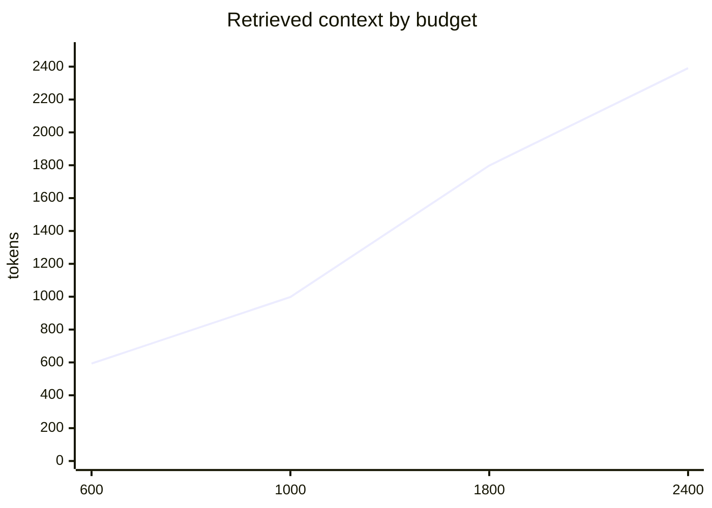

# Graphora

> Local structural memory and an evidence layer for AI coding agents.

[Português](../README.md) · [Español](README.es.md)

Graphora turns a repository into a local graph of files, symbols, relations, evidence, and attributed decisions. Its primary interface is not the dashboard: it is the small, traceable context an AI agent can retrieve before investigating or changing a project.

Instead of asking a model to read an entire repository, Graphora helps it locate the likely code region, follow nearby relations, stay within a token budget, verify claims against source lines, and preserve decisions for future sessions.

## Why it exists

Large repositories contain current code, legacy systems, generated bundles, tests, and documentation. Generic searches for words such as `session`, `user`, or `config` often return valid but irrelevant matches.

Graphora adds a retrieval layer:

```text
local repository
      ↓
files, symbols, and static relations
      ↓
graph with evidence and provenance
      ↓
token-bounded query
      ↓
agent verifies sources and writes the final answer
```

Graphora is an evidence provider. The model still has to select sources, distinguish fact from inference, and explain the result.

## Recommended agent workflow

1. Read `.graphora/project/CONTEXT.md` for a short orientation.
2. Query Graphora before broad repository exploration.
3. Prefer a behavior plus a concrete path or symbol.
4. Use `--node PATH_OR_SYMBOL` when a term is ambiguous.
5. Inspect cited source files before making important claims.
6. If `truncated` is true, narrow the query or raise the budget deliberately.
7. After source edits, run `graphora scan .` when no watcher is active.
8. Record only useful, attributed decisions and explicit preferences.

Example:

```bash
graphora query \
  "how does authentication use src/lib/session.ts?" \
  --node src/lib/session.ts \
  --budget 1200
```

`--node` accepts an internal ID, an exact or unique path, or a symbol name:

```bash
graphora query "who depends on this module?" --node src/lib/session.ts
graphora query "show the surrounding flow" --node requireUserId
```

If several symbols share the same name, the result reports candidates and the selected anchor. Use a path when ambiguity matters.

## Features

| Capability             | Agent benefit                                                                            |
| ---------------------- | ---------------------------------------------------------------------------------------- |
| Structural extraction  | Files, modules, functions, types, documents, and dependencies become queryable entities. |
| Directed relations     | Imports, definitions, calls, dependencies, and references help reconstruct flows.        |
| Contextual ranking     | Exact paths, symbols, term rarity, entity type, and graph proximity affect relevance.    |
| Human-readable anchors | `--node` accepts IDs, paths, and symbols.                                                |
| Token budgets          | Retrieval size stays explicit and predictable.                                           |
| Source evidence        | Results point to files and lines.                                                        |
| Incremental updates    | Unchanged extraction is reused; changed and deleted files are reconciled.                |
| Attributed memory      | Decisions preserve author, basis, source, and stale state.                               |
| Project network        | Cross-project observations remain separate from local project facts.                     |
| 2D and 3D observatory  | The same filtered graph can be explored in canvas or WebGL.                              |
| CLI, skills, and MCP   | Multiple agents can use the same local memory.                                           |

## Installation

Requirements: Node.js 22+, npm, and a modern browser.

```bash
git clone https://github.com/rm0ntoya/graphora.git
cd graphora
npm ci
npm test
npm run build
npm link
```

Without `npm link`, call `node /absolute/path/to/graphora/bin/graphora.js` instead of `graphora`.

Prepare a target project:

```bash
cd /path/to/project
graphora install .
graphora scan .
graphora .
```

Use `graphora . --no-open` to start the local server and watcher without opening a browser.

## AI assistant installation

```bash
graphora install .
```

The installer adds or updates integrations for:

| Client         | Project integration                                                |
| -------------- | ------------------------------------------------------------------ |
| Codex          | `AGENTS.md`, `.codex/skills/graphora/`, `.agents/skills/graphora/` |
| Claude Code    | `CLAUDE.md`, `.claude/skills/graphora/`, `/Graphora`, `.mcp.json`  |
| Gemini CLI     | `GEMINI.md`                                                        |
| Cursor         | `.cursor/rules/graphora.mdc`, `.mcp.json`                          |
| GitHub Copilot | `.github/copilot-instructions.md`                                  |
| Windsurf       | `.windsurf/rules/graphora.md`                                      |
| Roo Code       | `.roo/rules/graphora.md`                                           |
| Cline          | `.clinerules/graphora.md`                                          |
| OpenCode       | `.opencode/commands/graphora.md`                                   |

Managed instruction blocks preserve unrelated content. Tool-specific Graphora files are recreated idempotently.

Install user-level skills and the launcher with:

```bash
graphora install --global
```

### MCP

Compatible clients can run:

```json
{
  "mcpServers": {
    "graphora": {
      "command": "/absolute/path/to/node",
      "args": [
        "/absolute/path/to/graphora/bin/graphora.js",
        "mcp",
        "/absolute/path/to/project"
      ]
    }
  }
}
```

Available tools:

- `graphora_query`
- `graphora_inspect`
- `graphora_refresh`
- `graphora_network`
- `graphora_remember`

MCP configuration does not guarantee model usage. Some clients require activation or restart. A demonstrably Graphora-grounded answer should cite files and lines or show a tool call in the client history.

### Universal fallback

Any local agent that can execute a terminal can use Graphora, even without a native skill or MCP:

```text
Before broad exploration, run graphora query with a specific question.
Verify the cited source files. If truncated=true, refine the query.
Run graphora scan after edits when the watcher is inactive.
```

## Querying and ranking

```text
graphora query "question" [--budget N] [--depth N]
  [--node ID|PATH|SYMBOL] [--network] [--json]
```

Examples:

```bash
graphora query "where is the server port defined?" --budget 600

graphora query "how does a query reach the API?" \
  --node lib/query.js \
  --depth 2 \
  --budget 1800

graphora query "which technologies recur?" --network --json
```

Ranking combines exact paths, exact labels, word matches, term rarity, filenames, entity type, local degree, anchor proximity, generated-code penalties, and seed diversity across files. It reduces noise but cannot eliminate ambiguity in a large mixed monorepo.

When `truncated` is true, do not infer that omitted entities do not exist. Prefer a tighter path/symbol query before increasing the budget.

## 2D and 3D observatory

Both modes render the same filtered subgraph.

### 2D mode

- canvas rendering;
- pan, zoom, node drag, selection, focus, and PNG export;
- reduced occlusion for dense graphs.

### 3D mode

- WebGL spatial exploration;
- orbit controls and optional automatic rotation;
- animated focus and PNG export.

The force layout scales community spread, charge, link distance, and collision radius with visible node count. Choose **Adaptive**, **Compact**, or **Spacious** spacing.

The **Map settings** panel updates the graph in real time and keeps the choices in browser storage. It controls edge thickness, opacity and color; node and label scale; background; repulsion; link distance; collision margin; particles; and orbit speed. Physics controls affect both 2D and 3D, with additional WebGL-specific options. **Reset appearance** restores the balanced defaults.

The dashboard shows at most 700 entities in one slice, prioritizing the selection and highly connected entities. For graphs with tens of thousands of nodes, use search, type filters, or neighborhood isolation. Text retrieval remains the most efficient interface for a specific question.

## Persistent memory

```bash
graphora remember "Keep loopback binding" \
  --text "The dashboard must not accept external connections." \
  --kind decision \
  --basis explicit \
  --author user \
  --source lib/server.js:42
```

Use `inferred` for hypotheses. Use `explicit` only for a statement actually made by the attributed author. Memories become stale when their source changes or disappears and must be reviewed.

Cross-project patterns are observations, not confirmed user preferences.

## Exclusions and configuration

Graphora honors `.gitignore` and `.graphoraignore`. It excludes common dependency, cache, build, coverage, generated, sensitive, database, oversized, binary, and symlink sources.

Generated file patterns include `.min.js`, `.bundle.js`, `.generated.*`, `.designer.cs`, `.pb.go`, and hashed vendor chunks.

Example `.graphoraignore`:

```gitignore
legacy/
fixtures/
public/assets/
**/*.snapshot.ts
```

Example `.graphora/config.json`:

```json
{
  "maxFiles": 10000,
  "maxBytes": 1048576,
  "discover": false,
  "discoveryRoots": ["/controlled/project/root"]
}
```

For monorepos, run Graphora inside the relevant subproject or exclude unrelated systems.

## Commands

| Command                   | Purpose                                            |
| ------------------------- | -------------------------------------------------- |
| `graphora .`              | Scan, start the watcher, and open the observatory. |
| `graphora scan .`         | Refresh graph and reports.                         |
| `graphora query "..."`    | Retrieve bounded, sourced context.                 |
| `graphora serve .`        | Run the server in the foreground.                  |
| `graphora mcp .`          | Start the stdio MCP server.                        |
| `graphora install .`      | Install project integrations.                      |
| `graphora remember "..."` | Record attributed memory.                          |
| `graphora status .`       | Inspect watcher and scan state.                    |
| `graphora stop .`         | Stop the local project process.                    |

## Local artifacts

```text
.graphora/
├── config.json
├── project/
│   ├── CONTEXT.md
│   ├── PROJECT.md
│   ├── graph.json
│   ├── cache.json
│   ├── history.json
│   └── memory.json
├── network/
├── dashboard/
├── integrations.json
├── runtime.json
└── server.log
```

Use `CONTEXT.md` for orientation and bounded queries for investigation. Load `PROJECT.md` only when a full deterministic inventory is needed.

## Privacy and security

- HTTP binds to `127.0.0.1` only.
- Mutating requests require the expected local origin and header.
- Common secret, key, certificate, credential, and local database files are excluded.
- Obvious secret patterns are redacted before persistence.
- Symlinks are not followed.
- `.graphora/` should remain untracked and must be reviewed before sharing.

Secret filtering reduces risk but is not an absolute guarantee. Review derived artifacts and rotate any exposed credential.

## Context savings

The token budget limits retrieved context, not the total cost of an AI call. System instructions, history, tools, the question, and the final answer still consume tokens.

An observed measurement in this repository compared 56,063 raw tokens with a 593-token Graphora result at a 600-token budget. This is a retrieval reduction, not a guaranteed 98.94% API cost reduction.



## Development

```bash
npm ci
npm run dev
npm run build
npm test
npm run test:ui
```

## Limits

Graphora is an early release. Static relations do not prove runtime behavior. Extraction quality varies by language and coding style. Token limits do not guarantee relevance. A model may still misinterpret correct evidence. Graphora does not replace tests, logs, tracing, debugging, security review, or human judgment.

The precise claim is: **Graphora narrows and structures an AI agent's investigation space while preserving verifiable evidence; it does not automatically understand every repository end to end.**

## License

The repository does not yet contain a `LICENSE` file. Choose and publish a license before third-party distribution.
