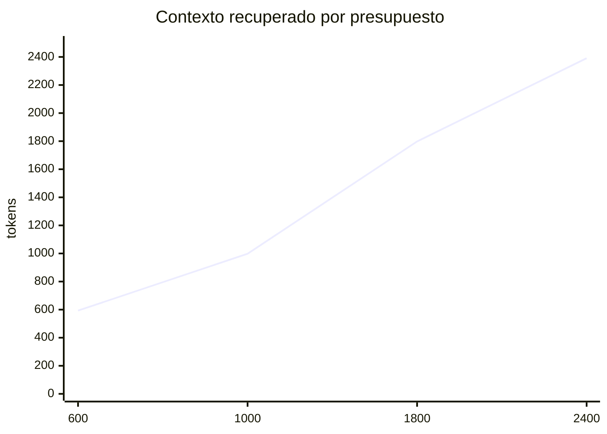

# Graphora

> Memoria estructural local y una capa de evidencias para agentes de IA que trabajan con código.

[Português](../README.md) · [English](README.en.md)

Graphora transforma un repositorio en un grafo local de archivos, símbolos, relaciones, evidencias y decisiones atribuidas. Su interfaz principal no es el dashboard: es el contexto pequeño y trazable que un agente de IA puede recuperar antes de investigar o modificar un proyecto.

En lugar de pedir al modelo que lea el repositorio completo, Graphora le permite localizar la región probable del código, seguir relaciones cercanas, respetar un presupuesto de tokens, verificar afirmaciones en las fuentes y conservar decisiones para sesiones futuras.

## Por qué existe

Los repositorios grandes mezclan código actual, sistemas heredados, bundles generados, pruebas y documentación. Una búsqueda genérica de `session`, `user` o `config` suele devolver coincidencias válidas pero poco relevantes.

Graphora agrega una capa de recuperación:

```text
repositorio local
      ↓
archivos, símbolos y relaciones estáticas
      ↓
grafo con evidencia y procedencia
      ↓
consulta limitada por tokens
      ↓
el agente verifica las fuentes y redacta la respuesta final
```

Graphora entrega evidencias. El modelo todavía debe seleccionar fuentes, separar hechos de inferencias e interpretar el resultado.

## Flujo recomendado para agentes

1. Leer `.graphora/project/CONTEXT.md` como orientación breve.
2. Consultar Graphora antes de explorar ampliamente el repositorio.
3. Formular una pregunta con comportamiento, ruta o símbolo concreto.
4. Usar `--node PATH_OR_SYMBOL` cuando un término sea ambiguo.
5. Abrir los archivos citados antes de afirmar hechos importantes.
6. Si `truncated` es `true`, refinar la consulta o aumentar el presupuesto deliberadamente.
7. Después de editar fuentes, ejecutar `graphora scan .` si el watcher no está activo.
8. Registrar únicamente decisiones útiles y preferencias explícitas con autor y fuente.

Ejemplo:

```bash
graphora query \
  "¿cómo usa la autenticación src/lib/session.ts?" \
  --node src/lib/session.ts \
  --budget 1200
```

`--node` acepta ID interno, ruta o nombre de símbolo:

```bash
graphora query "¿quién depende de este módulo?" --node src/lib/session.ts
graphora query "muestra el flujo cercano" --node requireUserId
```

Si varios símbolos comparten nombre, el resultado informa los candidatos y cuál fue seleccionado. Cuando la ambigüedad importe, usa una ruta.

## Capacidades

| Capacidad                 | Beneficio para el agente                                                                  |
| ------------------------- | ----------------------------------------------------------------------------------------- |
| Extracción estructural    | Archivos, módulos, funciones, tipos, documentos y dependencias son consultables.          |
| Relaciones dirigidas      | Imports, definiciones, llamadas, dependencias y referencias ayudan a reconstruir flujos.  |
| Ranking contextual        | Rutas exactas, símbolos, rareza de términos, tipo y proximidad influyen en la relevancia. |
| Anclas legibles           | `--node` acepta ID, ruta o símbolo.                                                       |
| Presupuesto de tokens     | El tamaño del contexto recuperado queda explícito.                                        |
| Evidencia en la fuente    | Cada resultado apunta a archivo y línea.                                                  |
| Actualización incremental | Reutiliza archivos sin cambios y reconcilia modificaciones y eliminaciones.               |
| Memoria atribuida         | Conserva autor, base, fuentes y estado obsoleto.                                          |
| Red de proyectos          | Las observaciones entre proyectos quedan separadas de los hechos locales.                 |
| Observatorio 2D y 3D      | El mismo recorte se explora en canvas o WebGL.                                            |
| CLI, skills y MCP         | Diferentes agentes usan la misma memoria local.                                           |

## Instalación

Requisitos: Node.js 22+, npm y un navegador moderno.

```bash
git clone https://github.com/rm0ntoya/graphora.git
cd graphora
npm ci
npm test
npm run build
npm link
```

Sin `npm link`, utiliza `node /ruta/absoluta/graphora/bin/graphora.js` en lugar de `graphora`.

Prepara un proyecto:

```bash
cd /ruta/al/proyecto
graphora install .
graphora scan .
graphora .
```

`graphora . --no-open` inicia el servidor local y el watcher sin abrir el navegador.

## Instalación en asistentes de IA

```bash
graphora install .
```

El instalador agrega o actualiza:

| Cliente        | Integración del proyecto                                           |
| -------------- | ------------------------------------------------------------------ |
| Codex          | `AGENTS.md`, `.codex/skills/graphora/`, `.agents/skills/graphora/` |
| Claude Code    | `CLAUDE.md`, `.claude/skills/graphora/`, `/Graphora`, `.mcp.json`  |
| Gemini CLI     | `GEMINI.md`                                                        |
| Cursor         | `.cursor/rules/graphora.mdc`, `.mcp.json`                          |
| GitHub Copilot | `.github/copilot-instructions.md`                                  |
| Windsurf       | `.windsurf/rules/graphora.md`                                      |
| Roo Code       | `.roo/rules/graphora.md`                                           |
| Cline          | `.clinerules/graphora.md`                                          |
| OpenCode       | `.opencode/commands/graphora.md`                                   |

Los bloques administrados conservan el contenido ajeno a Graphora. Los archivos específicos de Graphora se pueden regenerar de forma idempotente.

Instalación global de skills y launcher:

```bash
graphora install --global
```

### MCP

Los clientes compatibles pueden ejecutar:

```json
{
  "mcpServers": {
    "graphora": {
      "command": "/ruta/absoluta/a/node",
      "args": [
        "/ruta/absoluta/a/graphora/bin/graphora.js",
        "mcp",
        "/ruta/absoluta/al/proyecto"
      ]
    }
  }
}
```

Herramientas disponibles:

- `graphora_query`
- `graphora_inspect`
- `graphora_refresh`
- `graphora_network`
- `graphora_remember`

Configurar MCP no garantiza que el modelo lo use. Algunos clientes requieren activación o reinicio. Una respuesta demostrablemente basada en Graphora debe citar archivos/líneas o mostrar una llamada de herramienta en el historial.

### Alternativa universal

Cualquier agente local capaz de ejecutar comandos puede usar Graphora aunque no tenga skill o MCP:

```text
Antes de explorar ampliamente, ejecuta graphora query con una pregunta específica.
Verifica las fuentes citadas. Si truncated=true, refina la consulta.
Después de editar, ejecuta graphora scan si el watcher no está activo.
```

## Consultas y ranking

```text
graphora query "pregunta" [--budget N] [--depth N]
  [--node ID|PATH|SYMBOL] [--network] [--json]
```

Ejemplos:

```bash
graphora query "¿dónde se define el puerto del servidor?" --budget 600

graphora query "¿cómo llega una consulta a la API?" \
  --node lib/query.js \
  --depth 2 \
  --budget 1800

graphora query "¿qué tecnologías se repiten?" --network --json
```

El ranking combina ruta exacta, etiqueta exacta, palabras, rareza del término, nombre de archivo, tipo de entidad, conectividad, proximidad al ancla, penalización de código generado y diversidad de archivos.

Cuando `truncated` sea `true`, no concluyas que las entidades omitidas no existen. Primero especifica mejor la ruta o el símbolo.

## Observatorio 2D y 3D

Ambos modos muestran el mismo subgrafo filtrado.

### Modo 2D

- renderizado canvas;
- pan, zoom, arrastre, selección, foco y exportación PNG;
- menos oclusión en grafos densos.

### Modo 3D

- exploración espacial WebGL;
- controles orbitales y rotación automática opcional;
- foco animado y exportación PNG.

El layout ajusta dispersión, repulsión, distancia de enlaces y colisión según la cantidad de nodos visibles. Hay tres opciones: **Adaptativo**, **Compacto** y **Amplio**.

El panel **Ajustes del mapa** actualiza el grafo en tiempo real y conserva las preferencias en el navegador. Permite controlar grosor, opacidad y color de las conexiones; escala de nodos y rótulos; fondo; repulsión; distancia de enlaces; margen de colisión; partículas y velocidad de órbita. Los controles físicos afectan 2D y 3D, con opciones WebGL adicionales. **Restaurar visual** recupera los valores equilibrados.

El dashboard muestra como máximo 700 entidades por recorte y prioriza la selección y los nodos conectados. Para decenas de miles de nodos, utiliza búsqueda, filtros o aislamiento de vecindad. La consulta textual sigue siendo la interfaz más eficiente para una pregunta concreta.

## Memoria persistente

```bash
graphora remember "Mantener loopback" \
  --text "El dashboard no debe aceptar conexiones externas." \
  --kind decision \
  --basis explicit \
  --author user \
  --source lib/server.js:42
```

Usa `inferred` para hipótesis y `explicit` solo para declaraciones realmente hechas por el autor indicado. Si una fuente cambia o desaparece, la memoria puede quedar `stale` y debe revisarse.

Los patrones entre proyectos son observaciones, no preferencias confirmadas.

## Exclusiones y configuración

Graphora respeta `.gitignore` y `.graphoraignore`. Excluye dependencias, cachés, builds, cobertura, fuentes generadas, archivos sensibles, bases locales, binarios, archivos grandes y symlinks.

También filtra patrones como `.min.js`, `.bundle.js`, `.generated.*`, `.designer.cs`, `.pb.go` y chunks de vendor con hash.

Ejemplo `.graphoraignore`:

```gitignore
legacy/
fixtures/
public/assets/
**/*.snapshot.ts
```

Ejemplo `.graphora/config.json`:

```json
{
  "maxFiles": 10000,
  "maxBytes": 1048576,
  "discover": false,
  "discoveryRoots": ["/raiz/controlada/de/proyectos"]
}
```

En monorepos, ejecuta Graphora dentro del subproyecto relevante o excluye sistemas independientes.

## Comandos

| Comando                   | Finalidad                                       |
| ------------------------- | ----------------------------------------------- |
| `graphora .`              | Analiza, inicia watcher y abre el observatorio. |
| `graphora scan .`         | Actualiza grafo e informes.                     |
| `graphora query "..."`    | Recupera contexto limitado con fuentes.         |
| `graphora serve .`        | Ejecuta el servidor en primer plano.            |
| `graphora mcp .`          | Inicia MCP por stdio.                           |
| `graphora install .`      | Instala integraciones del proyecto.             |
| `graphora remember "..."` | Registra memoria atribuida.                     |
| `graphora status .`       | Consulta watcher y análisis.                    |
| `graphora stop .`         | Detiene el proceso local.                       |

## Artefactos locales

```text
.graphora/
├── config.json
├── project/
│   ├── CONTEXT.md
│   ├── PROJECT.md
│   ├── graph.json
│   ├── cache.json
│   ├── history.json
│   └── memory.json
├── network/
├── dashboard/
├── integrations.json
├── runtime.json
└── server.log
```

Usa `CONTEXT.md` para orientación y consultas limitadas para investigar. Carga `PROJECT.md` solo cuando necesites el inventario completo.

## Privacidad y seguridad

- HTTP escucha únicamente en `127.0.0.1`.
- Las operaciones mutables exigen origen local y el encabezado esperado.
- Se excluyen formatos comunes de secretos, claves, certificados, credenciales y bases locales.
- Los patrones obvios de secretos se redactan antes de persistir.
- No se siguen symlinks.
- `.graphora/` debe permanecer fuera del control de versiones.

El filtro de secretos reduce el riesgo, pero no es una garantía absoluta. Revisa los artefactos derivados y rota cualquier credencial expuesta.

## Ahorro de contexto

El presupuesto limita el contexto recuperado, no el costo total de una llamada de IA. Las instrucciones, el historial, las herramientas, la pregunta y la respuesta también consumen tokens.

Una medición en este repositorio comparó 56.063 tokens brutos con 593 tokens recuperados usando un presupuesto de 600. Es reducción de recuperación, no una garantía de 98,94% de ahorro total de API.



## Desarrollo

```bash
npm ci
npm run dev
npm run build
npm test
npm run test:ui
```

## Límites

Graphora está en fase early release. Las relaciones estáticas no prueban el comportamiento en runtime. La calidad de extracción varía según lenguaje y estilo. El presupuesto no garantiza relevancia. Un modelo aún puede interpretar mal una evidencia correcta. Graphora no sustituye pruebas, logs, tracing, debugger, revisión de seguridad ni juicio humano.

La afirmación precisa es: **Graphora reduce y estructura el espacio de investigación de un agente de IA y conserva evidencias verificables; no comprende automáticamente cualquier repositorio de extremo a extremo.**

## Licencia

El repositorio todavía no contiene un archivo `LICENSE`. Define y publica una licencia antes de distribuirlo a terceros.
